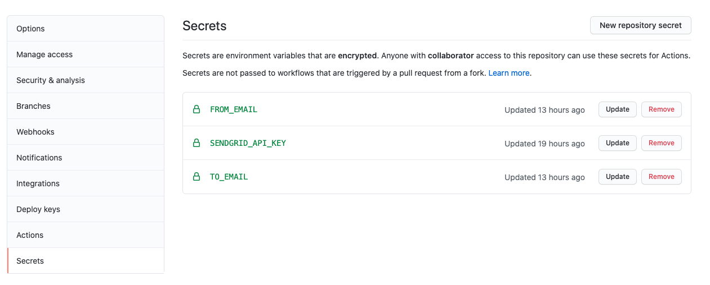

# pushemail-action

Send an email based on some trigger in GitHub. For example, send an email
if one or more files are pushed to repo.

## Requirements
The following variables are required to be set:
- API Key for SendGrid (Get [free](https://sendgrid.com/free/) API key)
- From email
- To email



## Usage

You can use the *pushemail-action* by: 
- creating a workflow in your repo with `.github/workflows/main.yml` 
- use the following example below for your implementation of `main.yml`
- change list under `paths:` to include the files and/or directories to trigger email

```yaml
name: "push-of-secure-file"
on:
  push:
    paths:
    - 'some-dir/**'

jobs:
  sendEmail:
    runs-on: ubuntu-latest
    steps:
    - uses: actions/checkout@v2
    - uses: johntday/pushemail-action@v1
      env:
        SENDGRID_API_KEY: ${{ secrets.SENDGRID_API_KEY }}
      with:
        fromMailAddress: '${{ secrets.FROM_EMAIL }}'
        toMailAddress: '${{ secrets.TO_EMAIL }}'
        subject: 'This is a test'
        subjectPrefix: 'Secure File Changed in Repo:'
        verbose: false
```

## Build
The command-line steps for building at repo root:
- `yarn install`
- `yarn package`
